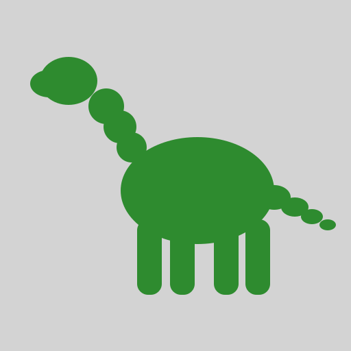

# Home Assistant — Dino Yard Player

<p align="center">
  
</p>

Custom integration that creates a **device** for the outdoor Raspberry Pi player.

Companion service: [dino-media-player](https://github.com/rbridal/dino-media-player).

## Logo

Simple green Sinclair-style sauropod on a solid light gray background.

Home Assistant 2026.3+ serves brand images only as PNG from:

`custom_components/dino_media_player/brand/`

Required names (light and dark, 1x and 2x):

- `icon.png` / `icon@2x.png`
- `dark_icon.png` / `dark_icon@2x.png`
- `logo.png` / `logo@2x.png`
- `dark_logo.png` / `dark_logo@2x.png`

SVG copies (`logo.svg`, `brand/icon.svg`) are for GitHub. They are **not** used by `/api/brands/integration/dino_media_player/...`.

Generate the PNG files from a clone:

```bash
python3 scripts/write_brand_pngs.py
git add custom_components/dino_media_player/brand brand
git commit -m "Add HA brand PNGs"
git push
```

Then HACS → Update, restart HA, hard-refresh the browser.

## Device entities

| Entity | Purpose |
| --- | --- |
| Availability | Connectivity. When off, the other entities on this device go unavailable. |
| Media | Select populated from files in `/opt/dino-media-player/media` |
| Playback state | `playing` / `stopped` |
| Current media | Filename now selected / playing |
| Position | Seconds into the track |
| Duration | Track length in seconds |
| Play | Start the selected file |
| Stop | Stop playback |

There is no pause/resume and no `media_player` entity.

## Install (HACS)

1. HACS → Integrations → Custom repositories
2. Add `https://github.com/rbridal/ha-dino-media-player` as **Integration**
3. Download, restart Home Assistant
4. Settings → Devices & Services → Add Integration → **Dino Media Player**
5. Set device name and MQTT topic prefix (`dino/player` unless you changed the Pi)

Reconfigure later from the integration → Configure.

After upgrading from v1, remove the old integration entry (it was a lone media player) and add it again so the device and new entities are created.

## Automation example

```yaml
alias: Dino motion — play theme
trigger:
  - platform: state
    entity_id: binary_sensor.YOUR_MOTION
    to: "on"
action:
  - service: select.select_option
    target:
      entity_id: select.dino_yard_player_media
    data:
      option: jurassic_park_theme.mp3
  - service: button.press
    target:
      entity_id: button.dino_yard_player_play
```

Entity IDs follow the device name you enter in the GUI.

## License
MIT
